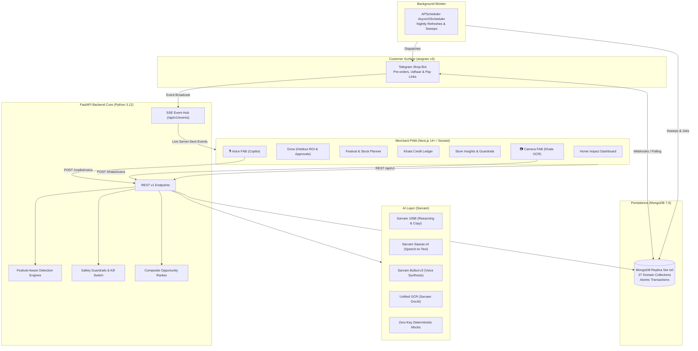

# VYOM — AI Business Partner for Paytm Merchants

> **VYOM** is an intelligent AI teammate that uncovers money a kirana or small-shop merchant is silently losing and recovers it. It natively understands Indian festivals, fasting rituals, and credit (*udhaar*) management, advising merchants on what their customers will need next.

---

## 1. System Architecture



---

## 2. Quickstart in 5 Commands

### Prerequisites
- Python 3.12+ with [`uv`](https://docs.astral.sh/uv/)
- Node.js 20+ with [`pnpm`](https://pnpm.io/)
- Docker & Docker Compose

### 5-Step Launch
```bash
# 1. Install Python dependencies
uv sync

# 2. Boot MongoDB single-node replica set (rs0)
docker compose up -d mongo

# 3. Seed 14-month synthetic transactions, Pune festival calendar & playbooks
make seed

# 4. Start FastAPI backend (http://localhost:8000)
make dev

# 5. Start Merchant Next.js PWA (http://localhost:3000)
make web
```

---

## 3. Core Surfaces & Capabilities

| Surface | Purpose | Highlights |
|---|---|---|
| **Merchant PWA** | Primary merchant control center | Mobile-first 5-tab IA, Obsidian/Paper fintech aesthetics, offline Serwist service worker, real-time SSE updates. |
| **🎙 Voice FAB** | Vyom AI Copilot | Instant speech-to-text (**Sarvam Saaras:v4**), natural speech playback (**Sarvam Bulbul:v3**), 2-phase confirmation cards for all state-changing actions. |
| **📷 Camera FAB** | Handwritten Khata Scanner | Multi-page capture, **Unified OCR (Sarvam Doc AI)** extraction, Devanagari numeral normalization (`१,२५०/-`), fuzzy customer matching table. |
| **Telegram Shop Bot** | Customer-facing storefront | Built with **aiogram v3**. Customers pre-order festival kits, check balances, receive polite udhaar reminders, and pay via simulated UPI. |
| **Festival Engine** | Regional ritual intelligence | Classifies Pune calendar phases (Ganesh post-dip, Pitru Paksha solemnity, Navratri vrat prep), advises on stock-up units, and enforces cultural tone rules. |

---

## 4. Key Golden Rules Enforced

1. **Numbers & Dates are Deterministic**: Prices, quantities, overdue balances, and festival dates are computed strictly by Python code from the database. The LLM only writes wording around verified facts.
2. **Safety Guardrails in Code**: Weekly message budgets, max discount caps (10%), and quiet hours (21:00 – 08:00 IST) are validated in code before sending.
3. **Emergency Kill Switch**: With one tap, the merchant halts all outgoing AI communications and udhaar sweeps.
4. **10% Holdout Control**: Every promotional campaign holds out 10% of customers as an uncontacted control group, calculating verifiable incremental return.
5. **Cultural Sensitivity**: During solemn periods (*Pitru Paksha*), aggressive promotional language ("Sale", "Dhamaka") is banned in code. Excluded categories (onion, garlic, non-veg) are never promoted in fasting kits.
6. **No Name-to-Religion Inference**: Customer religion or dietary habits are never inferred from customer names or behaviors—only from explicit customer self-declaration in the bot.

---

## 5. Configuration & Environment Reference

All configuration is managed via `.env` (derived from `.env.example`):

| Variable | Default (Demo) | Description |
|---|---|---|
| `AI_MODE` | `mock` | `mock` for zero-key demo mode, `live` for actual Sarvam & Google APIs |
| `DEMO_MODE` | `true` | Enables deterministic clock override and simulation endpoints |
| `DEMO_TODAY` | `2026-09-30` | Injectable reference date (Day 4 of Pitru Paksha, 11d before Navratri) |
| `SARVAM_LLM_MODEL` | `sarvam-105b` | Pinned Sarvam model (`sarvam-m` and `sarvam-30b` are deprecated) |
| `SARVAM_STT_MODEL` | `saaras:v4` | Sarvam Speech-to-Text model |
| `SARVAM_TTS_MODEL` | `bulbul:v3` | Sarvam Text-to-Speech model |
| `MONGODB_URI` | `mongodb://localhost:27017/vyom?replicaSet=rs0` | MongoDB 7.0 replica set URI |
| `APP_TIMEZONE` | `Asia/Kolkata` | Standard Indian Standard Time (IST) |

---

## 6. Verification & Test Suite

The entire backend and data intelligence layer is verified with strict typing and unit tests:

```bash
# Run 62 unit tests covering detection, AI layer, API v1, bot flows, and worker
make test

# Run Ruff linter
make lint

# Run MyPy strict type checking (checked 105 source files with 0 issues)
make types

# Build Next.js PWA bundle with Serwist service worker
cd apps/web && pnpm build
```

---

## 7. Documentation Index

- [System Architecture](docs/architecture.md)
- [MongoDB Data Model (27 Collections & ER Diagram)](docs/data-model.md)
- [Festival Context & Ritual Engine](docs/festival-engine.md)
- [Customer Telegram Bot Flows](docs/bot-flows.md)
