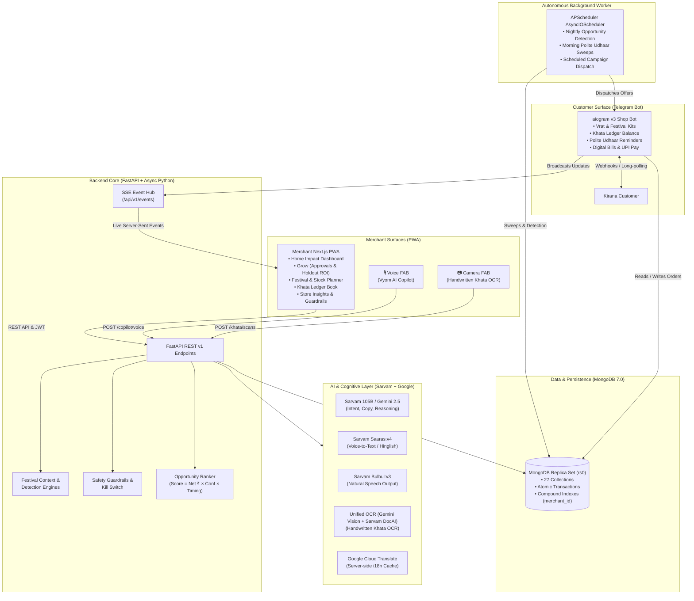

# VYOM — System Architecture

VYOM is an AI Business Partner for Indian Kirana & Retail merchants (specifically modeled on Sharma Kirana Store in Pune, Maharashtra). It actively uncovers silent revenue leakage, manages credit (udhaar) collections autonomously with cultural sensitivity, and prepares merchants for seasonal Indian festivals and fasting rituals.

---

## 1. Three Core Surfaces

1. **Merchant PWA (`apps/web`)**:
   - Mobile-first, installable Next.js 14+ App Router application with Serwist service worker for full offline resilience.
   - 5 core tabs: **Home**, **Grow**, **Festivals**, **Udhaar**, **Shop**.
   - Global 64px Voice FAB (Copilot) and 48px Camera FAB (Handwritten Khata OCR).
   - Strict fintech design tokens: Obsidian (`#070709`), Paper (`#ffffff`), Sky highlights (`#d7e6f5`), Blue accents (`#2597d0`), and sacred festive undertones.

2. **Customer Telegram Shop Bot (`vyom/bot`)**:
   - Customer-facing digital storefront built on `aiogram` v3.
   - Customers onboard via deep-links (`/start SHARMA01`), receive personalized festive kit pre-orders, check outstanding credit, request extensions, or pay via simulated Paytm UPI checkout.

3. **Backend & Detection Core (`apps/api`)**:
   - High-throughput asynchronous FastAPI engine using native `AsyncMongoClient` on MongoDB 7.0 replica set (`rs0`).
   - Clock service supporting injectable references (`DEMO_TODAY=2026-09-30`) so all festival phases, aging calculations, and evaluations are 100% deterministic and reproducible.

---

## 2. AI Architecture & Zero-Key Fallbacks

Vyom integrates cutting-edge Indian foundation models:
- **Sarvam 105B / Gemini 2.5**: Conversational copilot, customer copy generation, and slot extraction.
- **Sarvam Saaras:v4**: Robust speech-to-text with Hinglish and regional code-mixing.
- **Sarvam Bulbul:v3**: Text-to-speech for Hindi, Marathi, and Indian-accented English.
- **Unified OCR (Gemini Vision + Sarvam Doc AI)**: Extraction of handwritten rows from physical bahi-khata books with multi-level fallback.
- **Deterministic Zero-Key Mocks**: When `AI_MODE=mock`, mock implementations execute instantly using curated cultural fixtures, allowing presentations and evaluations to run completely keyless.

---

## 3. Strict Safety Guardrails

- **Kill Switch**: Merchant can immediately halt all outgoing AI campaigns and udhaar sweeps with one tap.
- **Quiet Hours**: No messages are dispatched between 21:00 and 08:00 IST.
- **Tone Rules**: Solemn periods (e.g. Pitru Paksha) forbid aggressive discount terms ("Sale", "Dhamaka") and enforce respectful framing. Excluded categories (onion, garlic, non-veg, eggs) are blocked in code from festive fasting promotions.
- **10% Holdout Control**: Every promotional campaign withholds 10% of the audience as an uncontacted control group, calculating verifiable incremental return.
