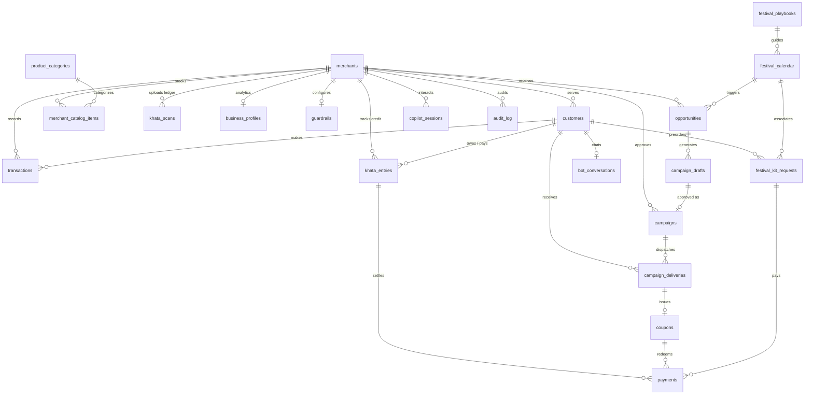

# VYOM — MongoDB Data Model & Schema Architecture

## Overview
VYOM uses MongoDB 7.0+ as a single-node replica set (`rs0`) to support multi-document ACID transactions across campaign executions, khata reconciliations, and payment flows.

- **Database**: `vyom`
- **Multi-Tenancy**: All merchant-scoped collections store `merchant_id` as a top-level field. Every compound index on merchant collections starts with `merchant_id`.
- **Timestamps**: All documents inherit `_id`, `created_at` (UTC), `updated_at` (UTC), and `schema_version` from `MongoModel`.
- **Monetary Values**: All money amounts are stored as integer **paise** (1 INR = 100 paise).
- **Timezone**: All application logic, festival windows, quiet hours, and daily rollups operate strictly in **Asia/Kolkata (IST)** via the injectable `Clock`.

---

## Entity Relationship Diagram

---

## Collection Directory (27 Collections)

### 1. Core Commerce
- **`merchants`**: Store profiles, regional attributes, shop code, timings, and festival preferences.
- **`otp_sessions`**: TTL-indexed authentication session store.
- **`customers`**: Customer profiles, Telegram linkage, explicit consent records, preferences (self-declared only), and RFM metrics.
- **`product_categories`**: Global kirana taxonomy with dietary and ritual tags (`vrat_friendly`, `sattvic`, `puja`, `sweet_ingredient`, `non_veg`, etc.).
- **`merchant_catalog_items`**: Custom store inventory with aliases, stock quantity, velocity, and pricing.
- **`transactions`**: POS purchases across Cash, UPI, and Khata.
- **`khata_entries`**: Digital credit ledger with due dates, reminder logs, and promise dates.
- **`khata_scans`**: Asynchronous OCR scan jobs for handwritten notebook digitization.
- **`business_profiles`**: Hourly heatmaps (7x24), dead hour slots, repeat rates, and trends.

### 2. Festival & Ritual Intelligence
- **`festival_calendar`**: Pan-India and regional festival dates, tithi offsets, and confidence rankings.
- **`festival_playbooks`**: Cultural guides with rituals, tone profiles (`festive`, `solemn`, `observant`), category uplifts, and excluded items.
- **`festival_kit_requests`**: Bundled festival essential orders placed via Telegram Bot or Merchant Copilot.

### 3. Growth & Campaigns
- **`opportunities`**: Automated revenue recovery opportunities (churn winback, dead hours, festival prep, stock-up).
- **`campaign_drafts`**: Proposed campaign variants evaluated against merchant guardrails.
- **`campaigns`**: Approved immutable snapshots scheduled for execution.
- **`campaign_deliveries`**: Individual message delivery attempts with 10% holdout groups.
- **`coupons`**: Unique discount voucher codes issued to customers.
- **`payments`**: Payment records for UPI dynamic QR links and payment links.
- **`guardrails`**: Budget limits, max discounts, quiet hours, and emergency kill switches.
- **`memories`**: Long-term merchant learning and campaign outcome memories.

### 4. Conversations & Platform
- **`bot_conversations`**: Telegram state machine with rolling conversational memory.
- **`bot_messages`**: Message history with 90-day TTL index.
- **`bot_updates_inbox`**: Update deduplication store with 48-hour TTL index.
- **`support_threads` / `support_messages`**: Human-in-the-loop support relay between merchant and customer.
- **`copilot_sessions` / `copilot_messages` / `copilot_pending_actions`**: Merchant AI voice/text copilot sessions and two-phase action confirmations.
- **`audit_log`**: Tamper-evident activity stream.
- **`translation_cache` / `tts_cache` / `ai_usage` / `push_subscriptions` / `notifications` / `_migrations`**: Platform infrastructure and caching.
